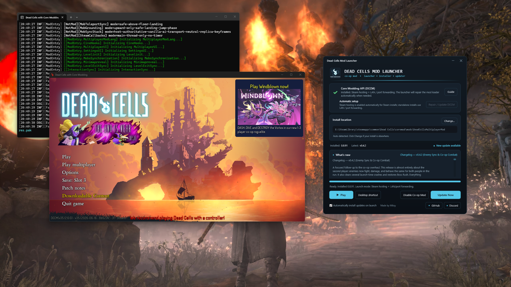
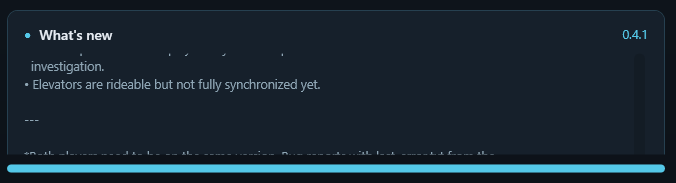

<p align="center">
  
</p>

<h1 align="center">Dead Cells Mod Launcher</h1>

<p align="center">
  A one-click installer, updater and launcher for the <strong>Dead Cells Multiplayer Mod</strong>.
</p>

<p align="center">
  
  
  
  
</p>

---

## Download

Open the **Releases** section on this repository and download the newest launcher build.

For most players the setup is simply:

1. Open **Dead Cells Mod Launcher**.
2. Let it detect your Dead Cells folder, or choose it manually.
3. Press **Install**.
4. Press **Play**.

The launcher handles the multiplayer mod, DCCM setup, updates and the correct launch method automatically.

> [!IMPORTANT]
> This is an unofficial community project. It is not affiliated with or endorsed by Motion Twin, Evil Empire or the Dead Cells rights holders.

## Features

| | |
|---|---|
| **One-click installation** | Detects Dead Cells and installs the multiplayer mod into the correct DCCM folder. |
| **Automatic DCCM setup** | Downloads and installs/repairs the required Dead Cells Core Modding files. |
| **Steam multiplayer setup** | Prepares the DCCM Steam launch path needed by the mod's Steam hosting/joining features. |
| **Non-Steam support** | Uses the direct DCCM path for LAN and direct-IP / port-forwarded sessions. |
| **Build-aware updates** | Detects both new version numbers and replaced/re-uploaded builds that keep the same version number. |
| **Manual update fallback** | Shows **New update available** and **Update Now** if an automatic update has not completed. |
| **Vanilla mode** | **Disable Co-op Mod** restores a normal Dead Cells launch without Core Modding; **Enable Co-op Mod** switches it back. |
| **DCCM repair** | A dedicated **Install / Repair DCCM** action can repair the core without reinstalling everything manually. |
| **Patch notes** | Shows the latest release notes directly inside the launcher. |
| **Desktop shortcut** | Creates a shortcut using the correct Steam or standalone launch path. |

## Steam, LAN and port forwarding

### Steam

On a Steam installation, the launcher prepares DCCM's Steam bootstrap path and starts Dead Cells through Steam. This lets the multiplayer mod use the Steam-side hosting and joining functionality when it is available.

### LAN / port forwarding

Steam is not required for the launcher itself. Standalone installations use DCCM directly and can use the multiplayer mod's LAN/direct-connect path.

This is useful for:

- computers on the same local network;
- direct IP connections;
- router port forwarding;
- setups where Steam networking is unavailable or intentionally not being used.

## Full vanilla mode

You do **not** need to uninstall the launcher or delete DCCM to play normal Dead Cells.

Press:

**Disable Co-op Mod**

The launcher parks the multiplayer mod, removes DCCM from the active launch path and starts the real vanilla game executable. On Steam it also restores a verified vanilla game launcher instead of starting **Dead Cells with Core Modding**.

When you want multiplayer again, press:

**Enable Co-op Mod**

The launcher restores the mod and DCCM Steam launch setup automatically.

## Smart updates

The launcher does not rely only on the visible version number.

For example, both of these will update players:

```text
Installed: 0.4.1
GitHub:    0.4.2
→ normal version update
```

```text
Installed: 0.4.1
GitHub:    0.4.1
Package:   replaced with a newer 0.4.1 build
→ build update detected
```

After installation the launcher stores the identity of the exact GitHub release asset it installed. A replaced ZIP therefore counts as a new build even when `modinfo.json` and the release tag still say the same version.

When an update is waiting, the launcher shows:

> **● New update available**  
> **Update Now**

If automatic updating fails, the warning remains visible so the player can retry manually.

## Screenshots

<p align="center">
  
</p>

<details>
<summary>Patch notes panel</summary>
<br>
<p align="center">
  
</p>
</details>

## Installation layout

The launcher manages the important files for you. A typical co-op installation looks like this:

```text
Dead Cells/
├─ coremod/
│  ├─ core/
│  │  └─ host/
│  │     └─ startup/
│  │        └─ DeadCellsModding.exe
│  ├─ mods/
│  │  └─ DeadCellsMultiplayerMod/
│  └─ launcher/
│     └─ steam/
│        └─ deadcells.exe
├─ deadcells.exe
└─ deadcells.launcher-backup.exe
```

Players normally do not need to touch these files themselves.

## 🔐 Release security

Public releases are packaged to be easier to inspect: the launcher and its .NET runtime files are stored normally inside a ZIP rather than packed into a compressed/self-extracting executable. Every release also contains SHA-256 checksums.

A trusted Windows code-signing certificate can be added without changing the source; the GitHub workflow will then Authenticode-sign and verify `DeadCellsModLauncher.exe` before packaging the release.

> [!WARNING]
> Never tell users to disable Windows Defender or their antivirus. A specific malware detection should be investigated and reported with the exact detection name.

## Troubleshooting

### The launcher cannot modify the Dead Cells folder

Close Dead Cells and Steam processes that may be using the files. If the game is installed in a protected Windows folder, run the launcher as administrator and try again.

### DCCM is missing or damaged

Press **Install / Repair DCCM**.

### An update is shown but did not install automatically

Press **Update Now**. The launcher keeps the update warning visible until the new package has been installed successfully.

### Vanilla mode still opens Core Modding

Use the latest launcher build, press **Disable Co-op Mod**, then launch with **Play Vanilla**. The current vanilla-mode logic verifies that it is not intentionally starting the DCCM host or DCCM Steam shell.

### Steam hosting is unavailable

LAN / direct IP / port forwarding can still be used through the standalone DCCM launch path.

## Development

The launcher is a Windows WPF application targeting .NET 8. The public release build is intentionally published as a normal self-contained folder instead of a compressed/self-extracting single executable.

From the repository root:

```powershell
dotnet publish src/DeadCellsModLauncher/DeadCellsMultiplayerModInstaller.csproj `
  -c Release `
  -r win-x64 `
  --self-contained true `
  -p:PublishSingleFile=false `
  -p:IncludeNativeLibrariesForSelfExtract=false `
  -p:EnableCompressionInSingleFile=false `
  -o dist/publish
```

The launcher source is designed around a simple player-facing goal: **install once, then press Play**.

## Credits

- **Launcher:** Miksy
- **Dead Cells Multiplayer Mod:** vaiserYT and contributors
- **Core modding platform:** Dead Cells Core Modding / DCCM contributors

Thanks to everyone testing multiplayer builds, reporting crashes and helping improve synchronization and compatibility.

## Community

- **Multiplayer Mod:** [vaiserYT/DeadCellsMultiplayerMod](https://github.com/vaiserYT/DeadCellsMultiplayerMod)
- **Discord:** [Join the community](https://discord.gg/rEAzpe7wyb)
- **DCCM:** [dead-cells-core-modding/core](https://github.com/dead-cells-core-modding/core)

---

<p align="center">
  <strong>Install. Update. Play co-op. Switch back to vanilla whenever you want.</strong>
</p>

---

## Release builds and security

The included GitHub Actions workflow builds the launcher automatically. A tag such as `v1.0.0` publishes:

- `DeadCellsModLauncher-win-x64.zip` — the complete self-contained Windows build;
- `SHA256SUMS.txt` — SHA-256 hashes for verifying the ZIP and launcher executable.

The release build does **not** use .NET single-file compression or native self-extraction. Optional Authenticode signing is already wired into the workflow and activates when the maintainer adds the signing certificate secrets described in [`SIGNING.md`](SIGNING.md).

See [`SECURITY.md`](SECURITY.md) for download verification and antivirus-warning guidance.
